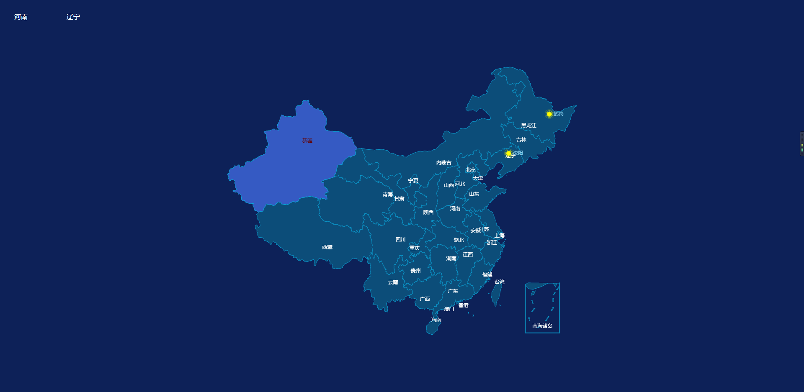
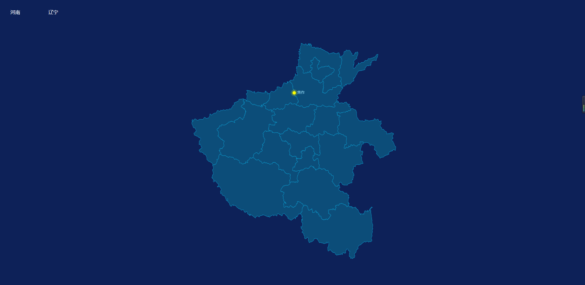

# Vue版本Echarts实现中国地图钻取以及点标记

## 1、功能描述与demo图片

>- 可以对省份以及地区进行钻取以及点标记
>- 鼠标经过样式，地图背景色 颜色等可以设置
>- 地图大小可以设置
>- 标记点颜色可以设置





## 2、运行及部署

### 2.1 本地运行
安装依赖

```
npm install
```
运行
```
npm run dev
```
### 2.2 部署
```
npm run build
```

## 3、GitHub地址


## 4、使用

> template中使用

````html
<div class="map">
	<chinaMap ref="map" :options="options" :width="width" :height="height" :code="code" :geoCoordMap="geoCoordMap"></chinaMap>
</div>
````

> script中

````javascript
<script>
import chinaMap from "./echarts/chinaMap";
export default {
  data() {
    return {
      width: '100%',
      height: '800px',
      options: {
        top: 0,
        map: 'china',
        // 是否运行缩放移动
        // 如果只想要开启缩放或者平移，可以设置成 'scale' 或者 'move'。设置成 true 为都开启
        roam: true,
        // 当前视角的中心点
        center: null,
        // 视角
        // aspectScale:0.75,
        // 当前视角的缩放比例。
        zoom: 1,
        // 滚轮缩放的极限控制
        // scaleLimit: {
        //   max:4,
        //   min:1
        // },
        // 选中地图 single单选  multiple多选
        selectedMode: 'multiple',
        // 地图上文字样式与显示
        label: {
          show: false,
          color: '#fff',
          emphasis: {
            show: true
          }
        },
        itemStyle: {
          // 地图线条颜色
          normal: {
            areaColor: 'rgba(12,82,124,.9)',
            borderColor: '#0A93C6',
            // 描边线条样式
            borderType: 'solid',
            // 描边宽度
            borderWidth: 1
            // 设置边框阴影
            //  shadowColor: 'rgba(0, 0, 0, 0.5)',
            //  shadowBlur: 10
          },
          // 鼠标经过时候的区域颜色
          emphasis: {
            areaColor: '#355AC3'
          }
        },
        // 地图中对特定的区域配置样式。
        regions: [
          // {
          //   name: "河南",
          //   itemStyle: {
          //     areaColor: "red",
          //     color: "red"
          //   }
          // },
          // {
          //   name: "焦作市",
          //   itemStyle: {
          //     areaColor: "red",
          //     color: "red"
          //   }
          // }
        ]
      },
      code: 100000,
      geoCoordMap: []
    };
  },
  components: {
    chinaMap
  },
  mounted() {
    this.getList()
  },
  methods: {
    getList() {
      // geoCoordMap 数据一般是后台返回的 格式为下面的格式
      this.geoCoordMap = [{
          name: '河南',
          value: [113.52, 35.22, 1525]
        },
        {
          name: '河南2',
          value: [106.3586, 38.1775, 1525]
        }]
      // 重新渲染地图
      setTimeout(() => {
        this.$refs.map.mapChart("mapChart");
      }, 500);
    },
    /*  getMap方法说明
     *  @method 查询省份地图
     *  @param { Number } code 城市代码
     *  @param { Array } geoCoordMap 实际值 
     *  @param { mapMsg } 配置项 
     */
    getMap(code, geoCoordMap, mapMsg) {
      this.code = code;
      this.geoCoordMap = geoCoordMap;
      for (let key in mapMsg) {
        this.options[key] = mapMsg[key];
      }
      setTimeout(() => {
        this.$refs.map.mapChart("mapChart");
      }, 500);
    }
  }
};
</script>
````

> style样式

````css
.home {
  width: 100%;
  height: 100vh;
  background: #0d2158;
}
.btn {
  width: 100px;
  height: 80px;
  display: inline-block;
  margin-right: 20px;
  line-height: 80px;
  cursor: pointer;
  text-align: center;
  color: #fff;
}
.map {
  width: 100%;
  /* height: 500px; */
}
````


